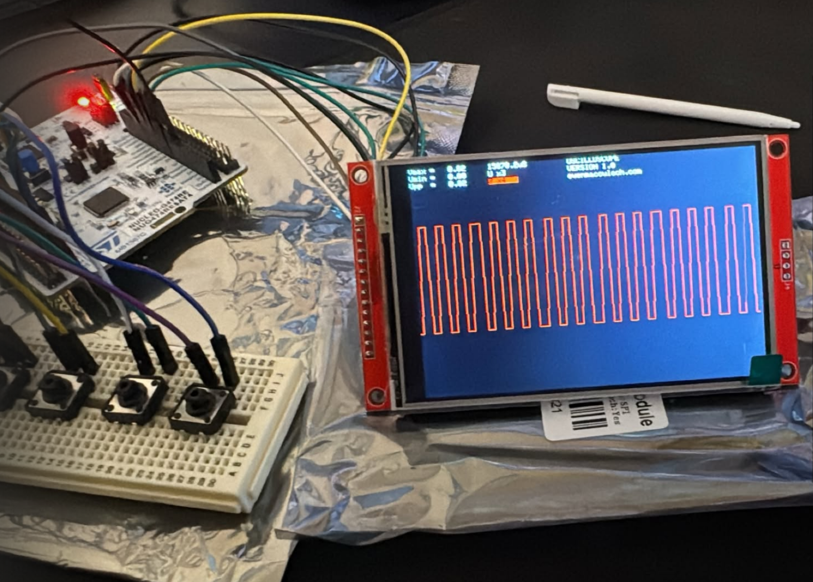

# STM32 Oscilloscope (Nucleo-G474RE + ST7796S)

A **compact, real-time digital oscilloscope** built on the **STM32 Nucleo-G474RE**, featuring a **320×480 ST7796S TFT display**, button-driven UI, persistent settings, and live waveform rendering.

This project is designed as a **hands-on embedded systems showcase**, combining ADC sampling, SPI graphics, EEPROM persistence, and a responsive UI on bare-metal hardware.

---

## Features

> [!TIP]
> - Real-time waveform capture using STM32 ADC
> - 12-bit resolution (0–3.3 V input range)
> - ST7796S 320×480 TFT display (SPI)
> - Adjustable:
>   - Time scale
>   - Vertical gain (amplitude)
>   - Zoom
>   - Y-offset
> - Grid on/off toggle
> - Signal inversion mode
> - HOLD (freeze waveform)
> - EEPROM-backed persistent settings
> - Startup loading screen with progress bar
> - Button-based UI (no serial input required)

---

## Preview

<p align="center">
  
</p>

---

## System Overview
```
ADC (PA0)
↓
Sample Buffer (1000 samples)
↓
Scaling / Zoom / Offset
↓
Waveform Renderer
↓
ST7796S TFT Display
```

## Hardware Requirements

- **STM32 Nucleo-G474RE**
- **ST7796S TFT Display (SPI)**
- 4× Push Buttons
- Analog signal source (0–3.3 V max)

---

## Display to Board Mapping

| ST7796S Display Pin | Nucleo-G474RE Pin |
|--------------------|------------------|
| VCC                | 3.3 V            |
| GND                | GND              |
| CS                 | PB6              |
| RST                | PA9              |
| DC / RS            | PC7              |
| MOSI               | PA7              |
| SCK                | PA5              |
| MISO               | PA6              |
| LED                | 3.3 V            |

---

## Button Mapping

| Nucleo-G474RE Pin | Function        |
|-------------------|-----------------|
| PA4               | UP              |
| PB0               | DOWN            |
| PC1               | SET / MODE      |
| PC0               | HOLD            |
| PA0               | ADC Input       |
| PA1               | ADC GND         |

---

## Controls & UI

### Modes (SET button cycles)
1. **Time Scale**
2. **Amplitude (Gain)**
3. **Zoom**
4. **Y-Offset**
5. **Grid Toggle**
6. **Invert Signal**

### Buttons
- **UP / DOWN** – Adjust current setting
- **SET** – Switch setting
- **HOLD** – Freeze / resume waveform

---

## Measurements Displayed

- **Vmax**
- **Vmin**
- **Vpp (Peak-to-Peak)**

All values are calculated live from the sampled buffer and scaled according to the current gain.

---

## Persistent Settings

- Time scale is stored in **EEPROM**
- Automatically restored on boot

---

## Build & Flash

1. Install Arduino IDE or PlatformIO
2. Select:
   - **Board:** Nucleo-G474RE
   - **Framework:** Arduino
3. Wire the display and buttons
4. Flash `main.ino`

---

## Safety Notice

> ⚠️ **Input voltage must not exceed 3.3 V**  
> This design does **not** include input protection or attenuation.
> Use external dividers or buffers for higher voltages.

---

## References

- [RIOT-OS Documentation – Nucleo-G474RE](https://doc.riot-os.org/group__boards__nucleo-g474re.html)
- ST7796S Datasheet
- STM32G4 Reference Manual

---

## 🛠️ Future Improvements

- Trigger modes (rising / falling)
- FFT spectrum view
- SD card capture
- USB data export
- Input protection stage

---